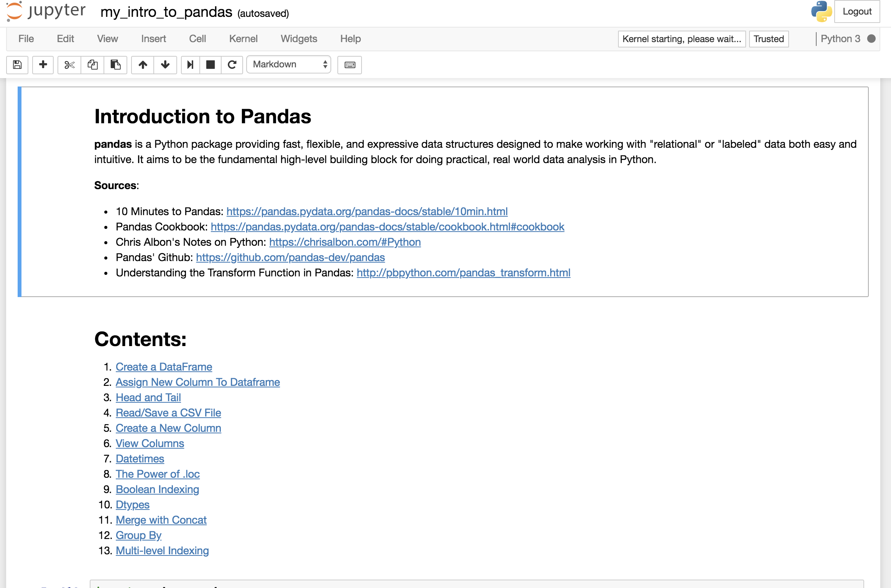

# Pandas Cheat-Sheet

Putting together in one Jupyter Notebook my notes on Pandas



### How to Run This Notebook
Make sure you have Jupyter Notebook [installed](https://jupyter.readthedocs.io/en/latest/install.html#new-to-python-and-jupyter).

Then, from your terminal, you can type
```
jupyter notebook
```

More info [here](http://jupyter-notebook-beginner-guide.readthedocs.io/en/latest/execute.html). :point_left:
